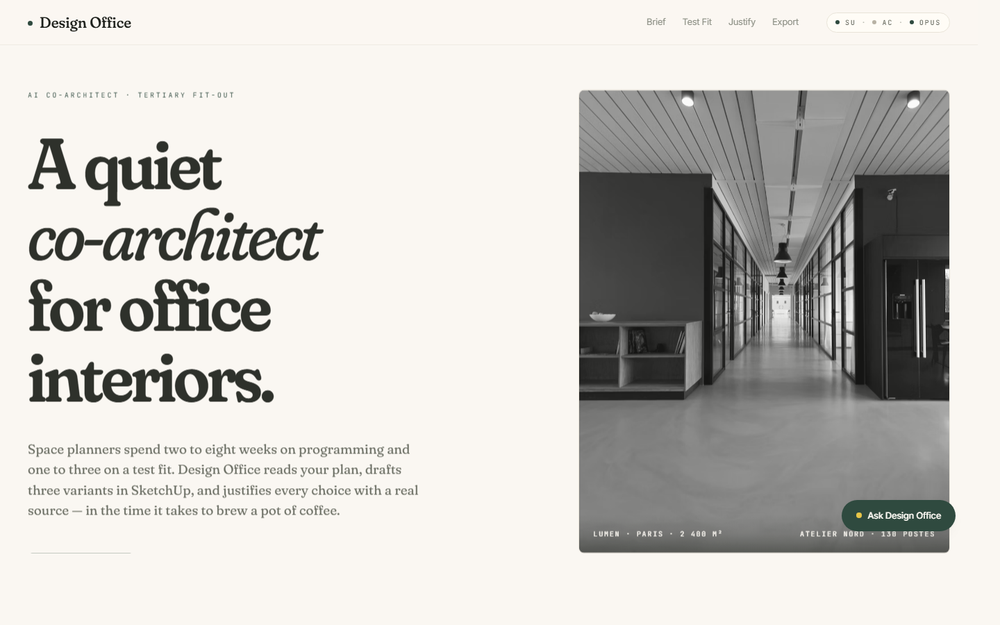
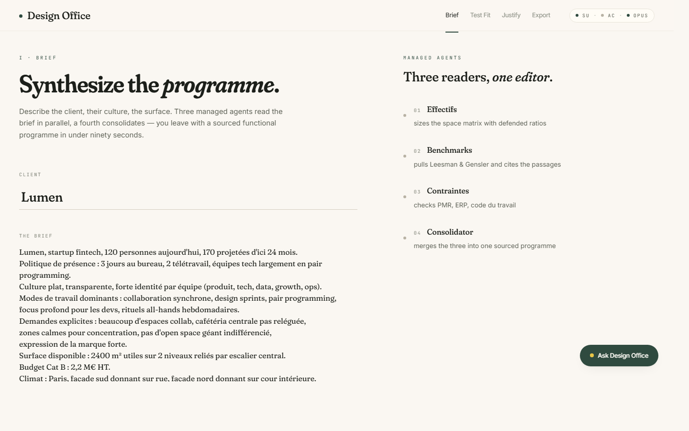
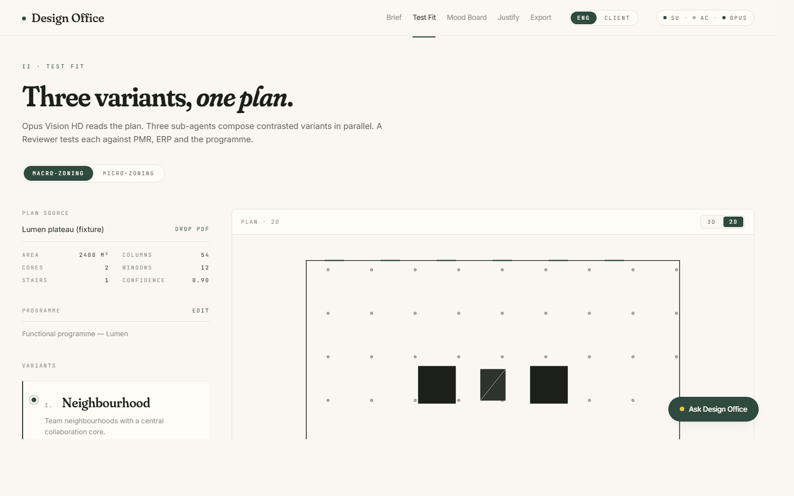
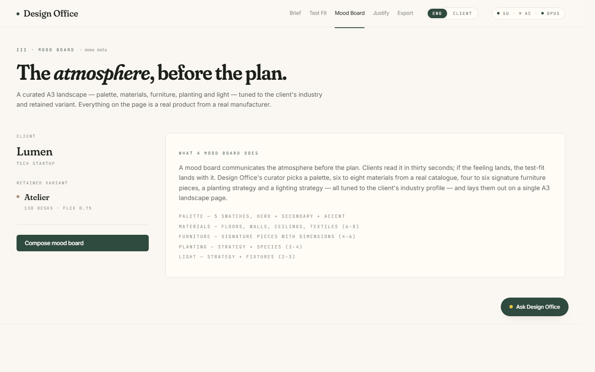
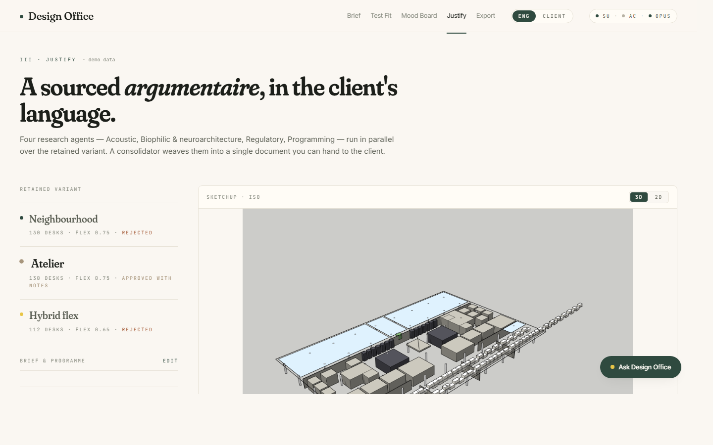
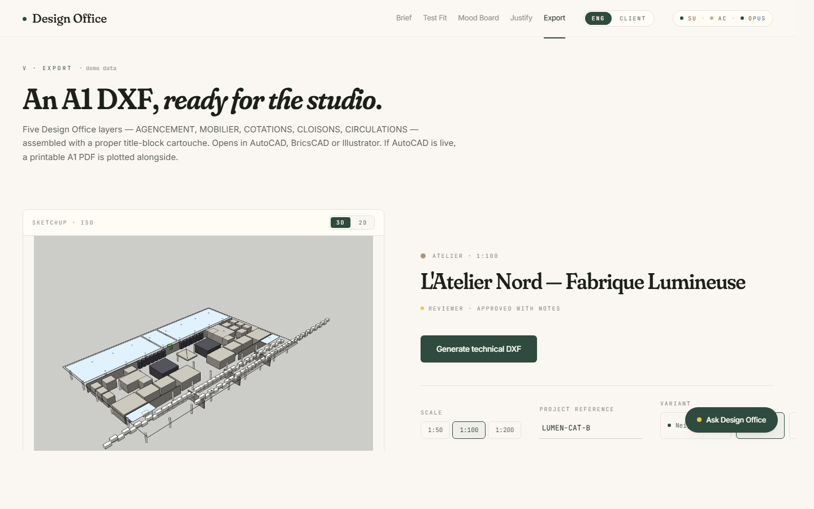
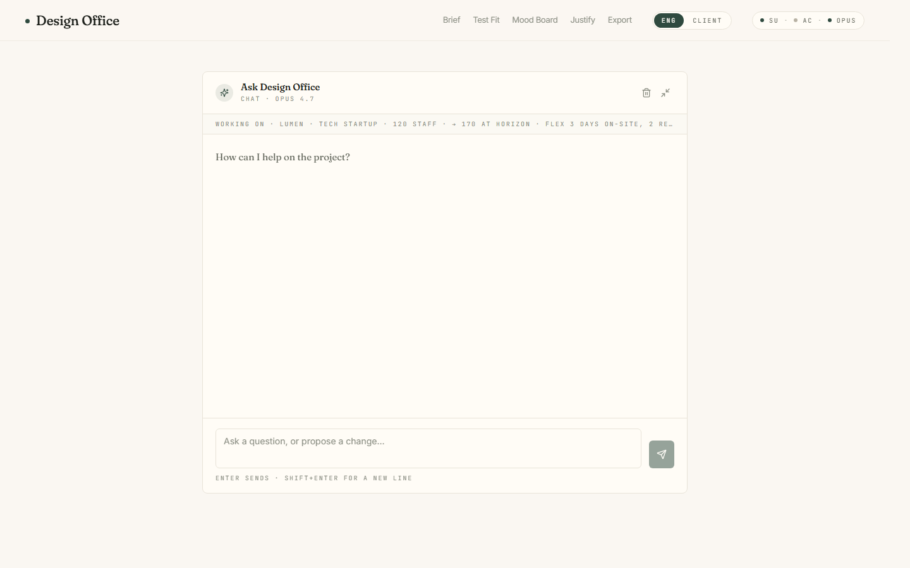

# Design Office

> **A quiet co-architect for office interiors.** Turn a client brief into a
> sourced programme, then a 3D test fit, a client-facing argumentaire, and a
> dimensioned A1 DWG — in minutes, not weeks.



Built for the Anthropic **Built with Opus 4.7** hackathon (deadline
2026-04-26). MIT License, 100 % open source.

## What it does

Design Office covers the five surfaces where space planners spend the most
time today, and where no serious AI tool exists :

| # | Surface | Input | Output | Time today |
|---|---------|-------|--------|-----------|
| 1 | **Brief** | Client brief + industry profile | Costed, sourced functional programme | 2 – 8 weeks |
| 2 | **Test fit — Macro-zoning** | PDF floor plan + programme | Three 3D variants in SketchUp, **iterable in natural language** | 1 – 3 weeks |
|   | **Test fit — Micro-zoning** | Retained variant | Per-zone drill-down (furniture SKUs, finishes, acoustic targets, light Kelvin), with 6-angle pseudo-3D viewer | ∅ today |
| 3 | **Mood Board** | Retained variant + industry | **A3 landscape PDF** (palette, materials, furniture, planting, light) — client-aware | 1 – 2 weeks |
| 4 | **Justify** | Retained variant | Client-facing argumentaire with citations + A4 PDF + 6-slide PPTX pitch deck (with client logo + SketchUp iso) | 3 – 5 days |
| 5 | **Export** | Retained variant | Dimensioned A1 DXF with Design Office layers | 2 – 4 days |

Everything orchestrated by Claude **Opus 4.7** — Vision HD reads the plans,
three-level managed-agent orchestration produces the programme / variants /
argumentaire, and 13 MCP Resources with real peer-reviewed sources back
every decision.

### Two personas, one product

A top-nav toggle flips the entire product between an **Engineering view**
(dense, numeric, technical) and a **Client view** (editorial, visual,
narrative). The interior architect wears both hats on the same project;
the product adapts instead of fighting them.

### Chat that actually acts

"Ask Design Office" is present on every page. It executes real actions
(`start_macro_zoning`, `iterate_variant`, `export_dwg`, etc.) against
the backend, not just suggests them. It also enriches the project state
from plain conversation: tell it "we have 140 staff now" and a
confirmation card pops up to update the programme. Full behaviour in
[`docs/CHAT_BEHAVIOR.md`](docs/CHAT_BEHAVIOR.md).

## Architecture

```
┌─────────────────────────────────────────────────────────────────┐
│  FRONTEND (React 18 + TypeScript + Tailwind + Framer)           │
│  Landing · Brief · Test Fit · Justify · Export                  │
└─────────────────────────┬───────────────────────────────────────┘
                          │
                          ▼
┌─────────────────────────────────────────────────────────────────┐
│  BACKEND (FastAPI + Python 3.11+)                               │
│  ├ Orchestrator (3 levels, ThreadPoolExecutor + retries)        │
│  ├ Vision HD PDF parser (fusion with PyMuPDF primitives)        │
│  ├ 10 MCP Resources (2 700 lines, fully sourced)                │
│  ├ 41-SKU furniture catalogue                                    │
│  ├ Claude client (exponential retries, JSONL audit log)         │
│  └ MCP clients (SketchUp TCP/JSON-RPC, AutoCAD ezdxf + File-IPC)│
└─────┬──────────────────────────────────────────┬────────────────┘
      │                                          │
      ▼                                          ▼
┌─────────────────────┐                 ┌────────────────────────┐
│  SKETCHUP MCP       │                 │  AUTOCAD MCP           │
│  (mhyrr/sketchup-   │                 │  (puran-water/         │
│   mcp forked)       │                 │   autocad-mcp forked)  │
│                     │                 │                        │
│  + DesignOffice     │                 │  + ezdxf headless      │
│    Ruby module      │                 │    DXF writer          │
│    (8 high-level    │                 │  + A1 sheet + cartouche│
│    ops : workstation│                 │  + 5 standard layers   │
│    cluster, meeting │                 │                        │
│    room, phone      │                 │                        │
│    booth, partition,│                 │                        │
│    collab zone,     │                 │                        │
│    biophilic zone…) │                 │                        │
└─────────────────────┘                 └────────────────────────┘
```

Deep dive in [`docs/ARCHITECTURE.md`](docs/ARCHITECTURE.md).

## The three-level managed-agent orchestration

| Level | Surface | Agents | Consolidator |
|-------|---------|--------|--------------|
| **1** | Brief | Effectifs / Benchmarks / Contraintes (parallel) | `brief_consolidator` |
| **2** | Test Fit | Villageois / Atelier / Hybride flex (parallel) + Reviewer × 3 | replay + review |
| **3** | Justify | Acoustic / Biophilic / Regulatory / Programming (parallel) | `justify_consolidator` |

Each sub-agent has a strict **no-fabrication** system prompt, cites every
number, and carries `[À VÉRIFIER]` markers through. Every Claude call is
retried with exponential jittered back-off and audited to
`backend/logs/api_calls.jsonl`.

## Creative Opus 4.7 usage

1. **Vision HD as the plan-reading brain** — every PDF upload is sent to
   Opus at 2 576 px with a strict JSON schema asking for envelope, columns,
   cores, stairs, windows, **text labels with purpose, orientation
   arrows, door swings, architectural symbols (WC / sink / compass / title
   block)**. Output is fused with a PyMuPDF vector extraction —
   PyMuPDF is the primitive source, Vision is the semantic layer.
2. **Managed agents at three levels** — each level solves a real planning
   problem with parallel specialists (not cosmetic parallelism). Token
   cost is real, quality gain is measurable.
3. **MCP Resources consulted at planning time** — 10 curated Markdown
   resources (2 700 lines total) covering NF S 31-080, NF S 31-199, ERP
   type W, PMR arrêté 20/04/2017, Browning 14 patterns, Kellert,
   Nieuwenhuis 2014, Hongisto / Haapakangas, Leesman multi-year, Gensler
   multi-year. Every number cited or flagged `[À VÉRIFIER]`.
4. **Double MCP CAD orchestration** — SketchUp (mhyrr/sketchup-mcp, fork)
   + AutoCAD (puran-water/autocad-mcp, fork) connected to the same
   backend. Rarely seen combined, drives the "Most Creative Opus 4.7
   Exploration" prize.

## Repository layout

```
design-office/
├── README.md
├── BUILD_LOG.md              # Every iteration timestamped, with tokens + outcomes
├── BLOCKERS.md               # Items needing the human (SketchUp install, API key rotation)
├── CLAUDE.md                 # Original mission brief (the autonomous agent's cahier des charges)
├── LICENSE                   # MIT
├── .env.example
│
├── backend/
│   ├── app/
│   │   ├── main.py           # FastAPI surface
│   │   ├── config.py         # pydantic-settings + .env override
│   │   ├── claude_client.py  # Retries + structured logs
│   │   ├── models.py         # FloorPlan, Variant, Reviewer verdicts
│   │   ├── agents/           # Orchestrator (ThreadPool + consolidator pattern)
│   │   ├── surfaces/         # brief.py, testfit.py, justify.py, export.py
│   │   ├── pdf/              # fixtures.py (Lumen plan generator), parser.py (hybrid)
│   │   ├── mcp/              # sketchup_client.py, autocad_client.py
│   │   ├── data/
│   │   │   ├── resources/    # 10 MCP Resources Markdown
│   │   │   ├── benchmarks/   # ratios.json (machine-readable)
│   │   │   ├── furniture/    # 41-SKU catalog.json
│   │   │   └── fixtures/     # Lumen fictitious plan PDF
│   │   ├── prompts/agents/   # 14 system prompts across the 3 levels
│   │   └── out/              # Generated PDFs (Justify) + DXFs (Export)
│   ├── tests/                # pytest, 100 tests covering all surfaces + the
│   │                         #   adjacency validator + structured micro-zoning
│   │   └── fixtures/         # Saved Lumen live outputs for replay / inspection
│   └── scripts/              # run_lumen_full.py, run_lumen_justify.py,
│                             # run_lumen_export.py, sketchup_smoke_cube.py,
│                             # run_lumen_sketchup.py
│
├── frontend/                 # Vite + React 18 + TS strict + Tailwind + Framer + tailwindcss-typography + Vitest
│   └── src/
│       ├── routes/           # Landing / ProjectDashboard / Brief / TestFit (macro+micro) /
│       │                     #   MoodBoard / Justify / Export / Chat
│       ├── components/ui/    # 12 shared primitives from the Claude Design handoff
│       │                     #   (Card, Pill, PillToggle, Drawer, AgentTrace,
│       │                     #    FloorPlan2D, Eyebrow, Icon, …)
│       ├── components/viewer # PlanSvg (envelope + columns + cores + zones)
│       ├── components/chat/  # ChatDrawer + ChatPanel + enrichment + action allow-list
│       ├── lib/adapters/     # 7 adapters : coordinates (88×62 ↔ mm),
│       │                     #   projectsIndex, variantAdapter,
│       │                     #   dashboardSummary, programmeSections,
│       │                     #   justifySections (+ coordinates.test.ts
│       │                     #   and adapters.test.ts with 41 Vitest tests)
│       └── lib/api.ts        # Typed client for the 6 surfaces + chat
│
├── claude-design-bundle/     # Source-of-truth handoff from claude.ai/design
│   └── opus-4-7/             # Tokens, screens, components the frontend ports from
│
├── vendor/
│   ├── sketchup-mcp/         # Forked mhyrr/sketchup-mcp
│   └── autocad-mcp/          # Forked puran-water/autocad-mcp
│
├── sketchup-plugin/
│   └── design_office_extensions.rb  # DesignOffice Ruby module (8 high-level ops)
│
├── docs/
│   ├── ARCHITECTURE.md
│   ├── DEMO_SCRIPT.md        # 3-min video shot-by-shot
│   ├── USE_CASE.md           # Full Lumen walkthrough
│   └── HACKATHON_SUMMARY.md  # Written submission summary
│
└── scripts/
    └── run_dev.ps1           # Launches backend + frontend in parallel (Windows)
```

## Quick start

### Prerequisites

- **Windows 10/11** (primary target — scripts are PowerShell)
- **Python 3.11+** (tested on 3.12)
- **Node 20+** (tested on 24)
- **Git**
- **SketchUp Pro** (trial OK) — optional for backend dev, required for 3D demo
- **AutoCAD LT 2024+** (trial OK) — optional, ezdxf backend works without it

### 1. Clone + env

```powershell
git clone <repo>
cd "Design Office"
cp .env.example .env
# Edit .env and paste a fresh ANTHROPIC_API_KEY from https://console.anthropic.com/
```

### 2. Backend

```powershell
cd backend
python -m venv .venv
.\.venv\Scripts\Activate.ps1
pip install -e ".[dev]"
pytest -q                       # 15 passed
```

### 3. Frontend

```powershell
cd ..\frontend
npm install
npm run build                   # verify it compiles
```

### 4. Launch everything

```powershell
cd ..
.\scripts\run_dev.ps1
# Backend on http://127.0.0.1:8000
# Frontend on http://localhost:5173
```

### 5. (Optional) Wire SketchUp live

Follow the checklist in [`BUILD_LOG.md`](BUILD_LOG.md) → "Saad-facing live
connection checklist" :

1. Copy `vendor/sketchup-mcp/su_mcp.rb` and `vendor/sketchup-mcp/su_mcp/`
   into your SketchUp Plugins folder
2. Copy `sketchup-plugin/design_office_extensions.rb` into the same
   folder
3. Restart SketchUp, then **Extensions → MCP Server → Start Server**
4. `python backend/scripts/sketchup_smoke_cube.py` — a 1 m cube should
   appear in your SketchUp model

### 6. (Optional) Wire AutoCAD live

1. In AutoCAD, `APPLOAD` → load `vendor/autocad-mcp/lisp-code/mcp_dispatch.lsp`
2. Add it to the Startup Suite
3. Set `AUTOCAD_MCP_WATCH_DIR=<repo>\autocad_watch` in `.env`
4. Restart the backend — the Export surface auto-switches to the live
   File-IPC backend

## Try it on the Lumen fixture (no GUI)

The repo ships with **live-generated fixtures** under
`backend/tests/fixtures/` :

- `generate_output_sample.json` — the 3 Test Fit variants + 3 reviewer
  verdicts for Lumen (142 k input / 22 k output tokens, 108 s).
- `justify_output_sample.json` — the consolidated argumentaire (148 k /
  22 k tokens, 229 s, 14 242 chars, 5 agents).
- `lumen_justify_pitch_deck.pptx` — the 6-slide pitch deck derived from
  the argumentaire (39 KB, opens in PowerPoint / Keynote / Slides).
- `lumen_export_atelier.dxf` — the Atelier variant rendered to an A1 DXF
  (168 KB, 334 ops, all 5 Design Office layers populated).

Replay :

```powershell
cd backend
.\.venv\Scripts\Activate.ps1
python scripts/run_lumen_full.py        # regenerate 3 variants + 3 reviewers
python scripts/run_lumen_justify.py     # regenerate Justify argumentaire + PDF
python scripts/run_lumen_pptx.py        # regenerate the 6-slide pitch deck (no Opus)
python scripts/run_lumen_export.py      # regenerate the DXF (no Opus)
```

Each script writes outputs back to `tests/fixtures/` and
`app/out/justify/` / `app/out/export/`.

## Design language

Design Office ships with an **Organic Modern** identity — ivory paper
(`#FAF7F2`), forest accent (`#2F4A3F`), sand and sun pigments for the
three variants, clay for errors. Typography is Fraunces (variable,
SOFT + opsz axes) for display + body, Inter for UI, JetBrains Mono for
labels. The aesthetic reference is Kinfolk magazine, Saguez & Partners,
MoreySmith — never a SaaS dashboard.

The seven page captures below come from headless Chrome at 1 440 × 900.
(Seven = six surfaces + the dedicated /chat fullpage route.) Two mobile
captures at 375 × 812 live under
[`docs/screenshots/mobile/`](docs/screenshots/mobile) — the main nav
collapses below `lg`, the integration-status badge is hidden below
`md`, the hero headline re-scales (`44px → 56px → 72px → 104px`), and
mobile users still reach every surface through the chat drawer's
`start_*` action dispatch.
Full principles + palette + motion tokens live in
**[`docs/UI_DESIGN.md`](docs/UI_DESIGN.md)**.

| I · Landing | II · Brief | III · Test Fit | IV · Mood Board | V · Justify | VI · Export | VII · Chat |
|:-:|:-:|:-:|:-:|:-:|:-:|:-:|
| [](docs/screenshots/01-landing.png) | [](docs/screenshots/02-brief.png) | [](docs/screenshots/03-testfit.png) | [](docs/screenshots/04-moodboard.png) | [](docs/screenshots/05-justify.png) | [](docs/screenshots/06-export.png) | [](docs/screenshots/07-chat.png) |

## Client-aware — the same system, three very different outputs

A fintech, a law firm and a creative agency ask for the same floor to
be fit out. Design Office reads the industry profile from the brief,
picks palette, materials, furniture and lighting from the right
catalogues, and produces a mood board that actually reads as
industry-appropriate rather than as beige LLM output. Every product
below comes from a real manufacturer, cited inline.

| Client · industry | Hero palette | Signature materials | Tagline (Opus-generated) |
|---|---|---|---|
| **Lumen · tech startup** | Linen canvas · Pale oak · Atelier ink · Studio putty · Lumen sun | Amtico Worn Oak, Kvadrat Remix, BAUX wood-wool, Farrow & Ball Railings, Framery One Compact | *An atelier of focus on the north light, a bright social forge on the south.* |
| **Altamont & Rees · law firm** | Chambers green · Walnut leather · Parchment · Ink graphite · Aged brass | Dinesen Douglas plank, Farrow & Ball Card Room Green, Mutina Margarita terrazzo, Gustafs walnut, Création Baumann Hush | *A discreet enfilade of chambers — where light is filtered, conversations stay, and every material earns its patina.* |
| **Kaito Miró · creative agency** | Plaster ivory · Kiln terracotta · Raw plywood · Concrete brut · Acid yellow | Polished concrete, Clayworks clay plaster, BAUX terracotta tiles, Woven Image EchoPanel (acid yellow), Bolon Artisan | *A loud, plaster-white gallery where every wall is a weekly exhibition.* |

Each one is a live Opus 4.7 run against the same orchestration code —
only the `client_industry` input and the brief text change. All three
A3 landscape PDFs are committed as fixtures and replayable without
another call:

- `backend/tests/fixtures/lumen_moodboard.pdf`
- `backend/tests/fixtures/altamont_moodboard.pdf`
- `backend/tests/fixtures/kaito_moodboard.pdf`

Each PDF is paired with a `*_selection.json` audit file containing the
structured curator output that fed the renderer.

### The adaptation reaches all the way up the funnel

The mood board is not the only surface that adapts — so does the Brief
synthesis. The same `Effectifs / Benchmarks / Contraintes / Consolidator`
orchestration that produces Lumen's programme (130 desks at **0.75 flex**,
a 260 m² central café, 14 phone booths and generous open-plan collab)
produces a radically different programme when fed Altamont's law-firm
brief (saved as `backend/tests/fixtures/altamont_brief_output.json`,
89 k in / 16 k out):

- **20 private partner offices** at 14 m² each (280 m² of dedicated
  partner space)
- **45 shared two-person associate offices** (810 m²)
- **~1.0 seats / FTE** flex ratio, argued as a *"deliberate
  counter-trend position against the 2024-2025 industry drift"* — the
  consolidator cites the legal-sector median and explains why
  confidential-matter exposure rules out hot-desking
- **3 depositions-ready boardrooms** (DnT,A ≥ 45 dB) instead of two
- **Library with 400 linear m of shelving**, **wine cellar**,
  **tasting kitchen with sommelier station** — all sized, placed, and
  justified against the brief's "client dinners" cue
- **10 phone booths** (vs 14 for Lumen), with the consolidator's
  reasoning that *"most confidential calls happen inside offices"*

The only input that changed between the two runs was the brief text.
The ratios, the room typologies, the acoustic targets, the café vs
private-dining posture — everything else flows from what the industry-
aware agents infer from the text + the 13 sourced MCP resources.

## Documentation

- **[`docs/PRODUCT_VISION.md`](docs/PRODUCT_VISION.md)** — who the
  product is for, the six surfaces, macro/micro/mood vocabulary,
  Engineering vs Client views.
- **[`docs/CLIENT_AWARENESS.md`](docs/CLIENT_AWARENESS.md)** — deep-
  dive index of the three industry-adaptation proofs, with exact
  numbers, fixture pointers, and regression guards.
- **[`docs/CHAT_BEHAVIOR.md`](docs/CHAT_BEHAVIOR.md)** — how the chat
  actually runs actions + enriches the project state.
- **[`docs/ARCHITECTURE.md`](docs/ARCHITECTURE.md)** — deep dive on the
  surfaces, orchestration, Vision HD fusion, MCP integrations.
- **[`docs/UI_DESIGN.md`](docs/UI_DESIGN.md)** — visual language:
  palette tokens, typography, motion, a11y.
- **[`docs/PSEUDO_3D_VIEWER.md`](docs/PSEUDO_3D_VIEWER.md)** —
  6-angle SketchUp viewer for the Micro-zoning tab.
- **[`docs/FUTURE_WORK.md`](docs/FUTURE_WORK.md)** — Three.js 3D,
  Revit MCP, IFC, HRIS roadmap.
- **[`docs/USE_CASE.md`](docs/USE_CASE.md)** — full Lumen walkthrough
  with real numbers and screenshots.
- **[`docs/FLOW_WALKTHROUGH.md`](docs/FLOW_WALKTHROUGH.md)** — A-Z
  runbook on the Lumen fixture with tokens, durations, P0 / P1 / P2
  priorities.
- **[`docs/DEMO_SCRIPT.md`](docs/DEMO_SCRIPT.md)** — 3-min video
  shot-by-shot.
- **[`docs/HACKATHON_SUMMARY.md`](docs/HACKATHON_SUMMARY.md)** — written
  submission summary.
- **[`BUILD_LOG.md`](BUILD_LOG.md)** — every iteration, timestamped,
  with token usage and outcomes.

Run `.\scripts\demo_preflight.ps1` before recording the demo video.
It checks 27 things (artefacts, backend health, HTTP surfaces,
SketchUp MCP probe) end-to-end and prints a READY line when the
stack is green.

## License

MIT — see [`LICENSE`](LICENSE). All dependencies used are public
open-source packages. Every citation in the MCP Resources carries a
URL; figures not verified are flagged `[À VÉRIFIER]`.

## Acknowledgements

- [mhyrr/sketchup-mcp](https://github.com/mhyrr/sketchup-mcp) — the MCP
  server we forked and extended with our DesignOffice Ruby module
- [puran-water/autocad-mcp](https://github.com/puran-water/autocad-mcp)
  — the dual-backend AutoCAD MCP we forked
- Everyone whose peer-reviewed work is cited in the MCP Resources
  (Browning, Kellert, Heerwagen, Nieuwenhuis, Ulrich, Kaplan, Taylor,
  Hongisto, Haapakangas). The standards teams at AFNOR, ISO, WELL, and
  the regulatory authors at Légifrance.

Built with Opus 4.7.
